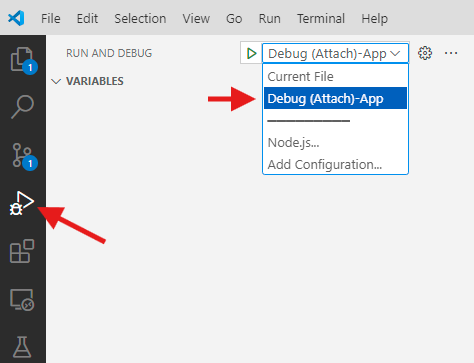

# quarkus-ai-search

This project uses Quarkus, the Supersonic Subatomic Java Framework.

If you want to learn more about Quarkus, please visit its website: <https://quarkus.io/>.

Quarkus offers a complete Command Line Interface (CLI) solution. If you have it installed on your dev environment, you can check the available options with 
```bash
quarkus --help
```

Besides that, you can use `maven|gradle` commands to build your code. A `maven` wrapper is also available (if you select `maven` as your build tool), which results in you not necessarily having to have `maven` installed. You can use this wrapper through the `mvnw` file

## Enabling Debugging Functionalities in VSCode
Quarkus exposes port 8080 for the application, and port 5005 for debuggin. To enable it in VS Code, you need to map this configuration in your `.vscode/launch.json` file.
The file should look like the one below:

```json
    "configurations": [
        {
            "type": "java",
            "name": "Current File",
            "request": "launch",
            "mainClass": "${file}"
        },
        {
            "type": "java",
            "name": "Debug (Attach)-App",
            "request": "attach",
            "hostName": "localhost",
            "port": 5005
        }
    ]   
```

By doing that, you can select Debug Mode when running the application, and execution will stop at the breakpoints you add to the code.



## Running the application in dev mode

You can run your application in dev mode that enables live coding using:

```shell script
# if you have quarkus cli installed, you can simply run: quarkus dev
./mvnw compile quarkus:dev

```

> **_NOTE:_**  Quarkus now ships with a Dev UI, which is available in dev mode only at <http://localhost:8080/q/dev/>.

### Calling REST Endpoints

A `test/rest.http` file is included in this repository.

With the application running, you can call the application endpoints with `curl` commands or using the http file for convenience.


## Packaging and running the application

The application can be packaged using:

```shell script
./mvnw package
```

It produces the `quarkus-run.jar` file in the `target/quarkus-app/` directory.
Be aware that it’s not an _über-jar_ as the dependencies are copied into the `target/quarkus-app/lib/` directory.

The application is now runnable using `java -jar target/quarkus-app/quarkus-run.jar`.

If you want to build an _über-jar_, execute the following command:

```shell script
./mvnw package -Dquarkus.package.jar.type=uber-jar
```

The application, packaged as an _über-jar_, is now runnable using `java -jar target/*-runner.jar`.

## Creating a native executable

You can create a native executable using:

```shell script
./mvnw package -Dnative
```

Or, if you don't have GraalVM installed, you can run the native executable build in a container using:

```shell script
./mvnw package -Dnative -Dquarkus.native.container-build=true
```

You can then execute your native executable with: `./target/quarkus-ai-search-1.0.0-SNAPSHOT-runner`

If you want to learn more about building native executables, please consult <https://quarkus.io/guides/maven-tooling>.

## CLI Commands worth exploring

```bash
# Build or push project container image. (docker, podman and others)
quarkus image --help

# deployment application in different modes (kubernetes, kind, minikube etc)
quarkus deploy --help


```


## Related Guides

- RESTEasy Classic JSON-B ([guide](https://quarkus.io/guides/rest-json)): JSON-B serialization support for RESTEasy Classic

## Provided Code

### RESTEasy JAX-RS

Easily start your RESTful Web Services

[Related guide section...](https://quarkus.io/guides/getting-started#the-jax-rs-resources)
